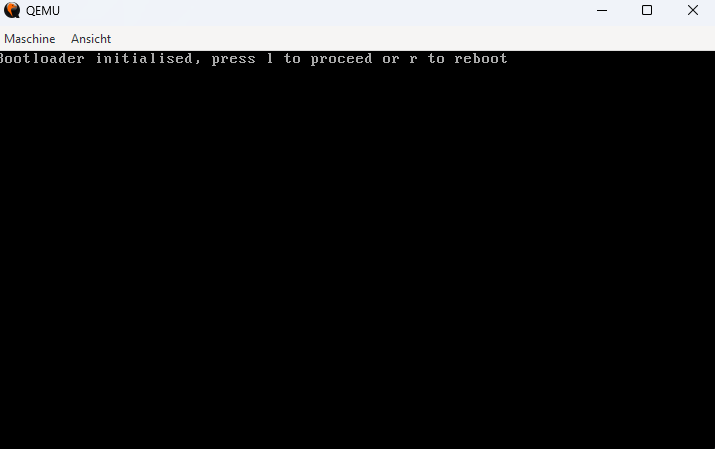

# Bootloader Project
A custom x86 bootloader written in Assembly, demonstrating BIOS interrupts, GDT setup, and mode switching.

## Description
This bootloader initializes in 16-bit real mode, sets up a text mode, prints a welcome message, and attempts to load a kernel into memory. It supports rebooting ('r') or loading a kernel ('l').

## Build Instructions
1. Install MSYS2, NASM, QEMU, and Make: `pacman -S mingw-w64-x86_64-nasm mingw-w64-x86_64-qemu mingw-w64-x86_64-make`.
2. Navigate to the project: `cd Bootloader`
3. Build: `mingw32-make`
4. Run: `mingw32-make run`

## Demo
